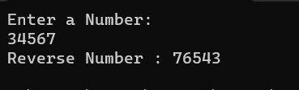

# Recursive-function

## Aim: 
To write a C# program to reverse a number using recursive function.

## Algorithm:
### Step 1 : 
Import the 'System' namespace to use the classes present in the 'System' namespace.
### Step 2 :
Declare a function to recursive reverse the digits in the number .
### Step 3 :
In the recursive function , find the remainder of the digit.If the remainder is equal to 0 then return 0 else add the remainder obtained and then call the function 'fun' again untill it turns 0.
### Step 4 :
Declare the Main function and get the user input .
### Step 5 :
Call the function and execute the program.
## Program:
```
using System;
namespace Program
{
    class Program
    {
        int rem = 0, rev = 0;
        public int fun(int number)
        {
            rem = number % 10;
            if (rem == 0)
            {
                return rev;
            }
            else
            {
                rev = rev * 10 + rem;
                return fun(number / 10);
            }
        }
        static void Main(string[] args)
        {
            int n;
        
            Console.WriteLine("Enter a Number: ");
            n = Convert.ToInt32(Console.ReadLine());

            Program reverse= new Program();
            Console.WriteLine("Reverse Number : {0} ",reverse.fun(n));
            
        }
    }
}
```
## Output:

## Result:
A C# program to reverse a number using recursive function is written and executed.